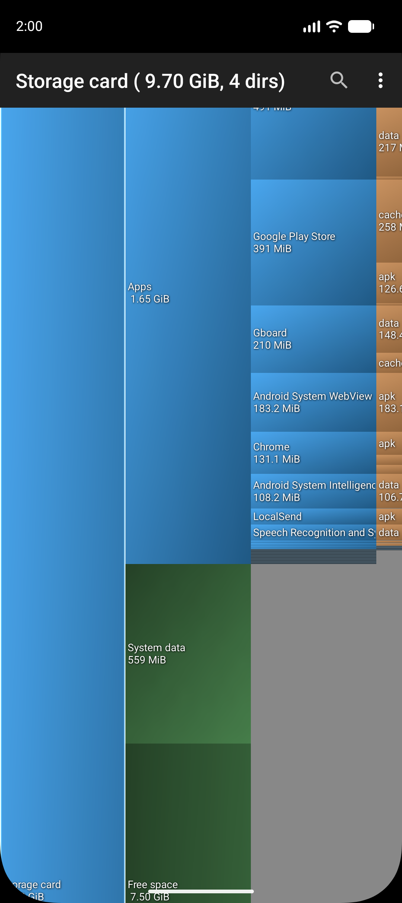

# DiskUsage
---

DiskUsage app for Android  

DiskUsage helps you find files and folders on your storage card that are using the most space.  
It displays a visual map in which directories are shown in proportion to their size, along with several levels of subdirectories.  
You can zoom in to explore the contents of individual directories.  

The purpose of the app is to help you identify and clean up space-hogging files on your storage card. It is not intended to be a general-purpose file manager.  

Screenshot for a recent version:

